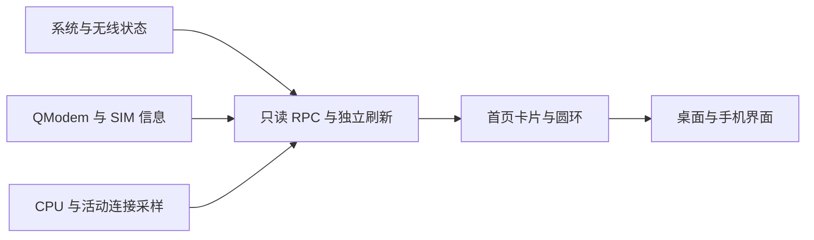
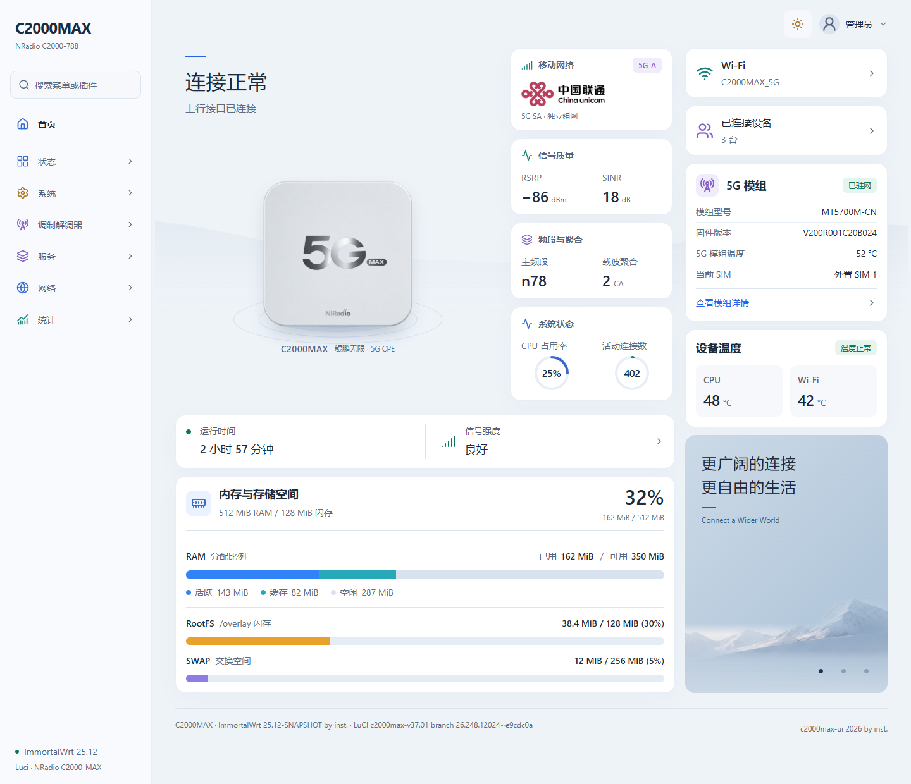
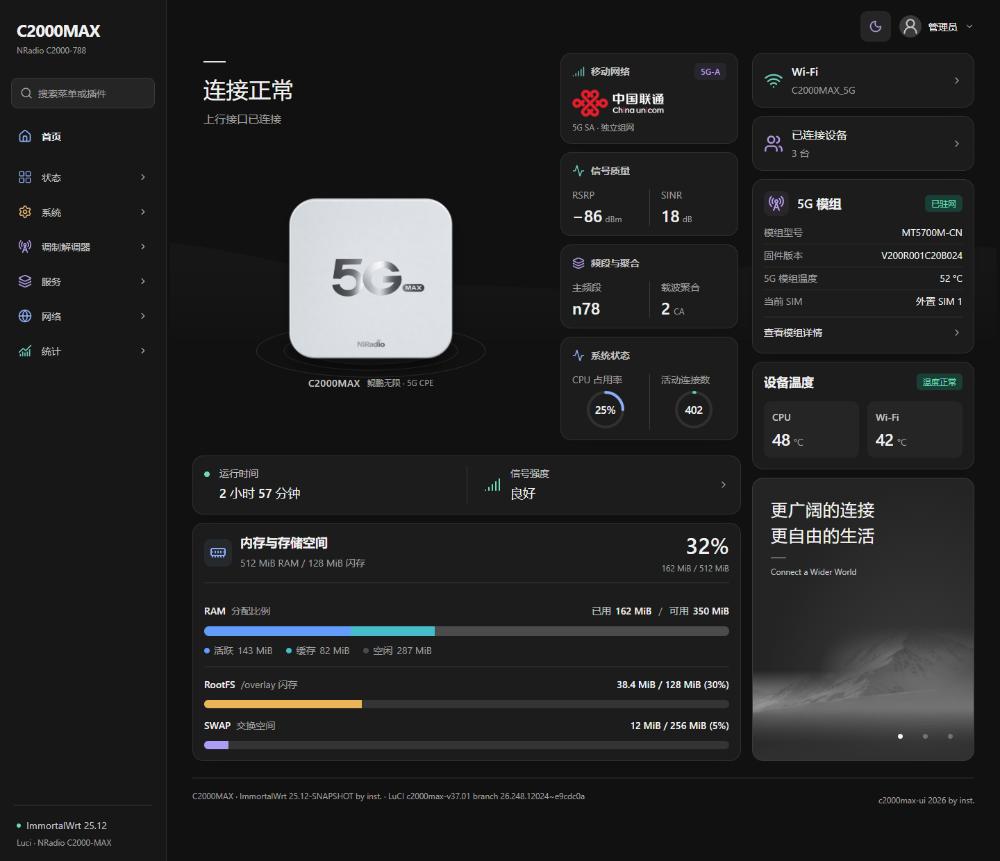
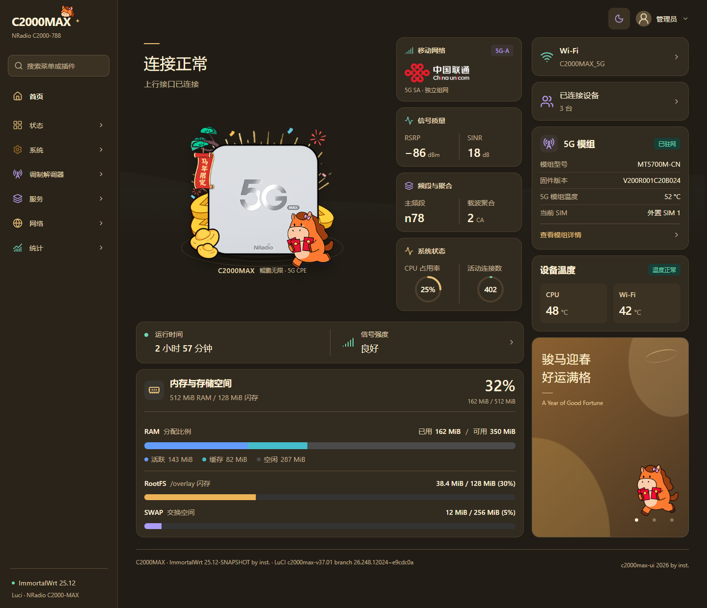
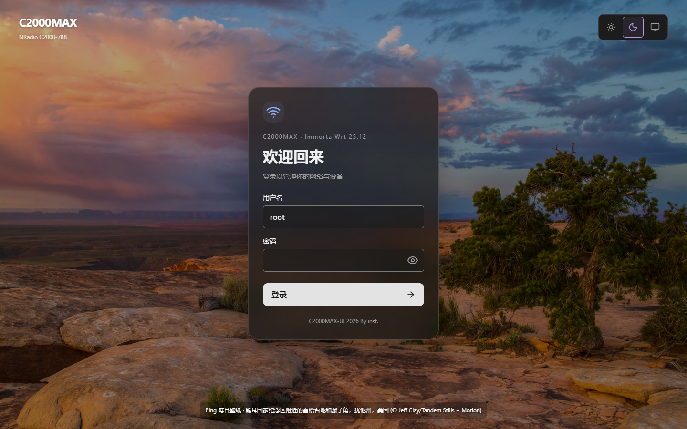
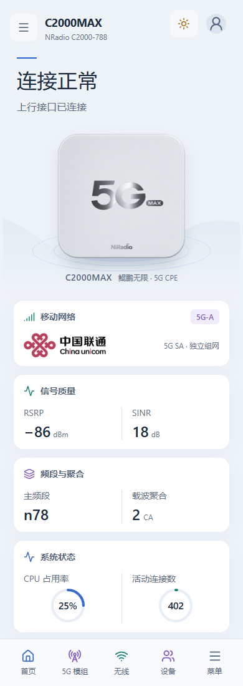
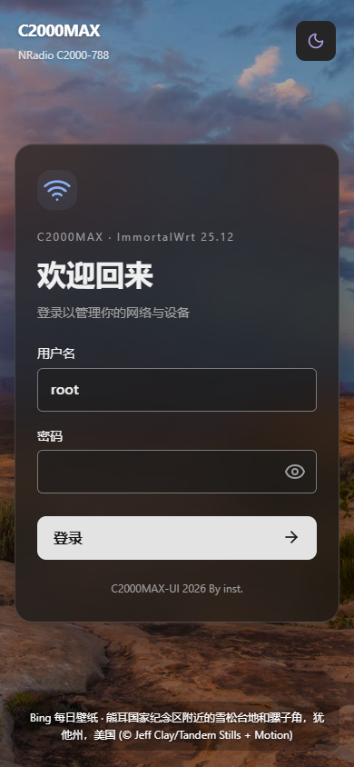

<div align="center">

# C2000MAX-UI

**面向 C2000MAX 的 OpenWrt / ImmortalWrt LuCI 主题**

从登录页和移动网络状态，到系统资源、温度与手机管理界面。

[](Makefile)
[](https://github.com/openwrt/luci)
[](https://nodejs.org/)
[](LICENSE)

[界面预览](#界面预览) · [安装与启用](#安装与启用) · [数据接入](docs/INTEGRATION.md) · [设计规范](docs/DESIGN-SYSTEM.md) · [开发与验证](#开发与验证) · [验证记录](docs/VALIDATION.md)

</div>

> [!NOTE]
> 主题使用 ucode 模板。当前实机验证环境为 ImmortalWrt 25.12-SNAPSHOT / NRadio C2000-MAX / MT5700M-CN。旧版 Lua 模板固件需要另行适配。

## 项目简介

C2000MAX-UI 将设备登录、移动网络读数和系统状态整合到 LuCI 首页，并为原生配置页面提供统一的外观。主题源码、资源、构建工具和测试在本仓库中独立维护，可直接接入 OpenWrt 构建树。

当前版本：`1.0.22-r1`。



## 界面预览

以下截图来自本地浏览器预览，使用示例数据。设备读数和菜单会随固件、插件与配置变化；登录页展示仓库附带的 Bing 回退壁纸，并保留原始署名。

### 经典银白 · 浅色



### 经典银白 · 深色



<details>
<summary>查看节日外观 · 马年限定</summary>



</details>

### 登录页



### 手机布局

| 首页 | 登录页 |
| :---: | :---: |
|  |  |

## 核心能力

- 登录页：Bing 每日壁纸、原生 LuCI 认证、密码显示切换；手机壁纸署名最多两行，不遮挡表单。
- 首页：运营商、5G / 5G-A、信号质量、主频段与载波聚合、模组型号/固件/温度/SIM。
- 系统状态：CPU 占用率与活动连接数圆环、运行时间、CPU/Wi-Fi 温度、内存/RootFS/SWAP。
- 系统读取短暂失败时保留近期有效读数，各资源组独立过期；RAM 空闲部分直接显示，只对已用部分做动画。
- 模组数据独立刷新，短暂失败保留有效样本，过期数值显示缺失；接口缓慢不会阻塞其他卡片。
- 浅色、深色、跟随系统，经典银白及节日外观；手机菜单搜索、抽屉和底部快捷导航。
- 适配原生 LuCI 表单、表格、页签、下拉框、弹窗和保存/应用流程。

5G-A 标记按界面组合规则显示：联通/电信 n78+n78，移动/广电 n41+n41+n79；该标记不等同于网络能力认证。

## 平台支持

| 平台 | 支持状态 | 说明 |
| --- | --- | --- |
| C2000MAX / ImmortalWrt 25.12-SNAPSHOT | 已验证 | ucode LuCI，APK 包，MT5700M-CN 模组 |
| 其他 ucode LuCI 固件 | 需验证 | 需对应 LuCI 与插件接口；部分设备读数可能不可用 |
| 旧版 Lua 模板 LuCI | 尚未适配 | 不能直接使用本包的 ucode 模板 |
| Linux / Windows WSL2 | 构建与开发 | 需要配置好的 OpenWrt 构建树或 SDK |
| Windows / Linux 本地浏览器 | 预览与测试 | Node.js 20+、Playwright；模板渲染需要原生 ucode |

## 项目结构

仓库根目录就是 `luci-theme-c2000max-ui` 包的根目录，可直接克隆到 OpenWrt 的 `package/custom/luci-theme-c2000max-ui`。

```text
.
├── Makefile                 # OpenWrt / LuCI 包定义
├── htdocs/luci-static/      # 样式、前端、首页与图片资源
├── ucode/template/         # 登录、导航与页脚模板
├── root/                   # RPC、ACL、配置和壁纸服务
├── tools/                  # 构建、模板验证、预览与测试入口
├── tests/                  # 合成数据及浏览器回归检查
├── docs/                   # 数据接入、设计规范和验证记录
└── build/                  # 本地编译产物和预览，不提交 Git
```

编译产物、测试生成的截图、设备备份和本机诊断脚本不纳入版本控制。README 的预览图保存在 `docs/screenshots/`，随文档维护。

## 本地快速开始

在已配置 LuCI feed 的 OpenWrt / ImmortalWrt 构建树或 SDK 中：

```sh
git clone https://github.com/jasonBrom/C2000MAX-UI.git \
  package/custom/luci-theme-c2000max-ui
make menuconfig
# LuCI → Themes → luci-theme-c2000max-ui，选择 M
make package/custom/luci-theme-c2000max-ui/compile V=s
```

也可以从仓库外的构建树编译，脚本会复制源码并校验构建前后的 `.config`：

```sh
OPENWRT_ROOT=/path/to/openwrt bash tools/build-local.sh
```

产物复制到 `build/`。可用 `JOBS` 设置并行数，`BUILD_TOOL_PATH` 补充构建工具路径。

## 安装与启用

将匹配固件的 APK 上传到设备 `/tmp` 后运行：

```sh
apk add --allow-untrusted --no-network /tmp/luci-theme-c2000max-ui-1.0.22-r1.apk
uci set luci.main.mediaurlbase='/luci-static/c2000max-ui'
uci commit luci
/etc/init.d/rpcd reload
/etc/init.d/uhttpd restart
```

也可在 **系统 → 系统 → 语言和界面** 中选择 **C2000MAX_UI**。首页为 `/cgi-bin/luci/admin/status/c2000max`。升级后重启 Web 服务，让 LuCI 与浏览器获取新的资源版本。

切回 Bootstrap：

```sh
uci set luci.main.mediaurlbase='/luci-static/bootstrap'
uci commit luci
/etc/init.d/rpcd reload
/etc/init.d/uhttpd restart
```

`apk del luci-theme-c2000max-ui` 可卸载；若正使用本主题，卸载脚本会恢复 Bootstrap。

## 数据与配置

基础系统状态来自只读 RPC。模组卡片需要 QModem；SIM 信息、硬件温度和 MTK 无线状态使用设备已有接口，没有相应插件时显示缺失值。首页会调用 QModem 的 `base_info` / `cell_info` 刷新读数。

`/etc/config/c2000max_ui` 可配置模组节名和 CPU/Wi-Fi 温度提醒线。详细接口、刷新周期及样本有效期见 [数据接入](docs/INTEGRATION.md)。

Bing 壁纸服务将每日图片缓存到 `/tmp/c2000max-ui`。登录请求读取本地缓存，联网失败保留原图或使用附带的回退图片；保留图片署名。

## 开发与验证

Node.js 20 或更新版本：

```sh
npm install
npm test
```

仓库也提供 `pnpm-lock.yaml`；使用 pnpm 时执行 `pnpm install --frozen-lockfile`，可安装本次验证使用的固定依赖。

模板验证需要支持 ucode 模板的原生 `ucode` 和 `fs` 模块，以及 LuCI Bootstrap 的 `cascade.css`：

```sh
UCODE_BIN=/path/to/ucode \
UCODE_LIB_DIR=/path/to/ucode/modules \
OPENWRT_ROOT=/path/to/openwrt \
  bash tools/validate-templates.sh
```

`UCODE_BIN` 默认从 PATH 查找 `ucode`；无需额外模块路径时可省略 `UCODE_LIB_DIR`。也可用 `BOOTSTRAP_CSS` 直接指定基础 CSS。需要从构建树生成验证运行时时，使用 `OPENWRT_ROOT=/path/to/openwrt bash tools/build-validator.sh`。

模板渲染后运行浏览器检查或开启预览：

```sh
npx playwright install chromium
npm run test:browser
npm run preview
```

浏览器检查自动启动并关闭预览服务。若希望使用本机 Edge，可设置 `PLAYWRIGHT_CHANNEL=msedge`。预览地址为 `http://127.0.0.1:4179/`，登录预览 `/login`。预览使用合成数据，不连接真实设备。

每次发布同时更新 `Makefile` 的包版本与模板/首页加载器中的缓存版本。参见 [验证说明](docs/VALIDATION.md)、[设计规范](docs/DESIGN-SYSTEM.md)及 [组件映射](docs/THEME-COMPONENTS.md)。

## 已知边界

- 模组、SIM 和硬件温度读数取决于设备提供的插件接口。
- 5G-A 是按载波组合生成的界面标记；动态读数超过有效期会显示缺失。
- 第三方插件的独立 iframe 或自带图表样式需要单独适配。
- 主题使用 LuCI 原生保存、应用和认证流程，首页数据接口只读。

## 许可证与致谢

主题代码使用 [Apache-2.0](LICENSE)。图片、运营商商标和 Bing 摄影作品的权利归原作者及权利人，来源与归属见 [NOTICE](NOTICE) 及资源目录内的来源说明。

感谢以下项目的作者与贡献者：

- [OpenWrt LuCI](https://github.com/openwrt/luci)：提供主题模板、配置表单与认证流程。
- [Argon Theme](https://github.com/jerrykuku/luci-theme-argon)：为导航、登录页、原生组件外观和响应式适配提供参考，详见 [Argon 组件审计](docs/ARGON-COMPONENT-AUDIT.md)。
- [Lucide](https://lucide.dev/)：提供界面图标。

也感谢 QModem 及相关设备插件的贡献者，为模组和设备数据接入提供基础。
